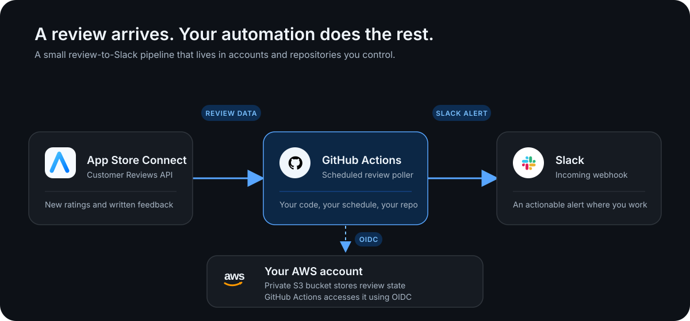

# App Store Reviews → Slack

Copy-ready building blocks for getting new App Store customer reviews into Slack—without handing your App Store data to another SaaS. This MIT-licensed reference implementation contains a dependency-free Python integration, a GitHub Actions workflow template, and least-privilege Terraform for its AWS state.

It is designed for developers who want to own and extend their App Store automation rather than rent another dashboard.



## What it does

- Looks up an app by bundle ID and polls App Store Connect for customer reviews.
- Posts each new review to a Slack incoming webhook with rating, title, body, reviewer, storefront, and creation time.
- Stores a timestamp-boundary watermark in your private S3 bucket: every review ID at the newest observed creation time, so a scheduled run only posts newly seen reviews even when timestamps tie.
- On its first run, creates the watermark but deliberately does not post historic reviews.
- Retries transient App Store Connect and Slack failures with bounded backoff.
- Uses GitHub Actions OIDC for AWS access—no long-lived AWS credentials are stored in GitHub.

The Python implementation uses only the standard library plus the `openssl` executable preinstalled on GitHub-hosted Ubuntu runners.

## Integrate it into existing repositories

Start with the building blocks that fit your existing setup. App Store Ops is a reference implementation, so it runs only its test suite; the [review workflow template](github-workflows/app-store-reviews.yml) becomes active only after you copy it into an application repository you control. The common arrangement is:

| Your repository | Copy from this repository |
| --- | --- |
| Application repository | `github-workflows/app-store-reviews.yml` → `.github/workflows/app-store-reviews.yml`, plus the two Python files under `scripts/` |
| Infrastructure repository | The standalone `terraform/` configuration, or its resources folded into your existing Terraform structure |

The workflow expects the copied Python files at these paths in the application repository:

```text
scripts/app_store_connect.py
scripts/app_store_reviews_to_slack.py
```

For example, from a local clone of this repository:

```sh
app_repo=/path/to/your-app
mkdir -p "$app_repo/.github/workflows" "$app_repo/scripts"
cp github-workflows/app-store-reviews.yml "$app_repo/.github/workflows/"
cp scripts/app_store_connect.py scripts/app_store_reviews_to_slack.py "$app_repo/scripts/"
```

The copied workflow runs daily at 08:00 America/Chicago. Adjust its schedule before committing it to your application repository if you prefer a different cadence.

## Provision the AWS state and IAM role

The included Terraform configuration is intentionally separate from the application files. Run it as a standalone root in your infrastructure repository, or integrate the resources with your existing Terraform configuration.

It creates a private, versioned S3 bucket and an IAM role whose only data access is the timestamp-boundary review watermark at `app-store-reviews/state.json`.

```sh
cd terraform
cp terraform.tfvars.example terraform.tfvars
# Edit terraform.tfvars with your bucket name, unique IAM role name, and GitHub OIDC subject.
terraform init
terraform apply
```

`github_actions_role_name` has no default: IAM role names must be unique within an AWS account, so choose one that identifies this application repository or infrastructure deployment.

Use the three Terraform outputs to create these **GitHub Actions repository variables in the application repository**:

| Variable | Terraform output |
| --- | --- |
| `AWS_REGION` | `aws_region` |
| `AWS_S3_BUCKET` | `state_bucket_name` |
| `AWS_ROLE_ARN` | `github_actions_role_arn` |

`github_oidc_subject` is intentionally an exact string, not a wildcard: it limits the role to the application repository and branch you approve. GitHub introduced immutable OIDC subjects for new repositories on July 15, 2026, so use the format that applies to your repository in `terraform.tfvars.example`. See GitHub’s [OIDC reference](https://docs.github.com/en/actions/reference/security/oidc) for the two formats.

If your AWS account already has the GitHub Actions OIDC provider, set `github_oidc_provider_arn` in `terraform.tfvars`; otherwise Terraform creates it. GitHub’s [AWS OIDC guide](https://docs.github.com/en/actions/how-tos/secure-your-work/security-harden-deployments/oidc-in-aws) explains the trust relationship.

## Configure the application repository

### 1. Create an App Store Connect API key

Request and create an App Store Connect API key with a role that can read the target app’s customer reviews. For a team key, App Store Connect uses **Users and Access → Integrations → App Store Connect API → Team Keys**. Download the `.p8` private key immediately—Apple makes it available only once—and never commit it. Apple documents the current process in [Creating API Keys for App Store Connect API](https://developer.apple.com/documentation/appstoreconnectapi/creating-api-keys-for-app-store-connect-api).

The integration reads reviews with Apple’s [Customer Reviews API](https://developer.apple.com/documentation/appstoreconnectapi/customer-reviews). Choose the narrowest App Store Connect role that has access to the app and reviews in your account.

### 2. Add GitHub Actions secrets and variables

In the application repository’s **Settings → Secrets and variables → Actions**, add:

| Type | Name | Value |
| --- | --- | --- |
| Secret | `APP_STORE_CONNECT_PRIVATE_KEY` | Entire contents of the downloaded `.p8` file |
| Secret | `APP_STORE_CONNECT_KEY_ID` | App Store Connect API key ID |
| Secret | `APP_STORE_CONNECT_ISSUER_ID` | App Store Connect issuer ID |
| Secret | `SLACK_WEBHOOK_URL` | Slack incoming-webhook URL for the destination channel; starts with [`https://hooks.slack.com/services`](https://hooks.slack.com/services) |
| Variable | `APP_STORE_CONNECT_BUNDLE_ID` | App bundle ID, for example `com.example.myapp` |
| Variable | `AWS_REGION` | Terraform `aws_region` output |
| Variable | `AWS_S3_BUCKET` | Terraform `state_bucket_name` output |
| Variable | `AWS_ROLE_ARN` | Terraform `github_actions_role_arn` output |

### 3. Run the copied workflow once

Open **Actions → App Store Reviews → Run workflow** in the application repository, on the branch named in `github_oidc_subject`. The first successful run saves every ID at the newest review timestamp as its watermark and sends no Slack notifications. It stops once that timestamp group is complete rather than traversing the app's full review history. Later scheduled runs post only new reviews.

## Local development

Run the test suite with the Python standard library:

```sh
python3 -m unittest discover -s tests -v
```

For a local manual run, pass a downloaded API key path and a disposable state file. Set `SLACK_WEBHOOK_URL` only when you intentionally want to post messages.

```sh
python3 scripts/app_store_reviews_to_slack.py \
  --bundle-id com.example.myapp \
  --key-path /secure/path/AuthKey_ABC123.p8 \
  --key-id ABC123 \
  --issuer-id 01234567-89ab-cdef-0123-456789abcdef \
  --state-file /tmp/app-store-review-state.json
```

## Security model

- The `.p8` key and Slack webhook are GitHub secrets, never Terraform variables or state.
- GitHub assumes a short-lived IAM role via OIDC. The generated policy can only list the state bucket and read/write one state object.
- The S3 bucket blocks public access, enables versioning, and expires noncurrent state versions after 30 days.
- If Slack rejects a message or App Store Connect fails, the state is not advanced. A later successful run retries the missed review rather than silently losing it.
- Notifications are delivered at least once. If Slack accepts an alert but the run fails before its updated state reaches S3, a later run can resend that review; every alert includes its App Store review ID for easy identification.

## License

[MIT](LICENSE)
